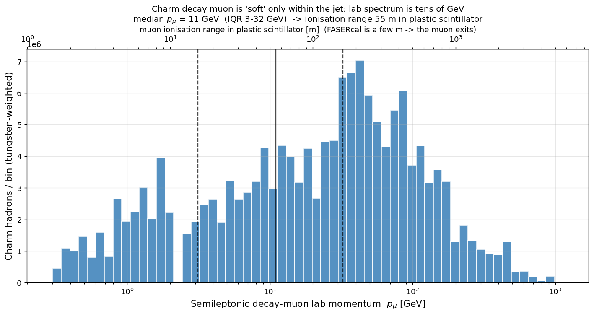
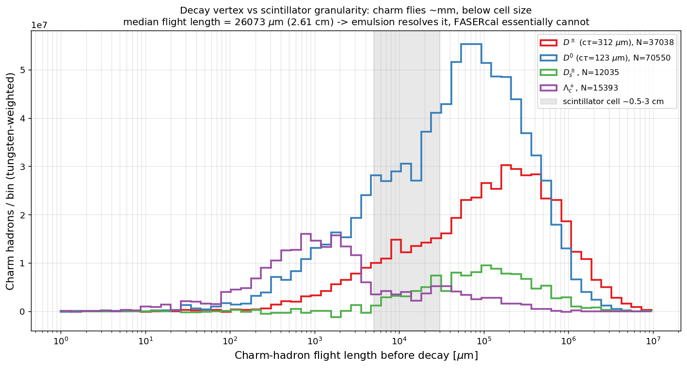
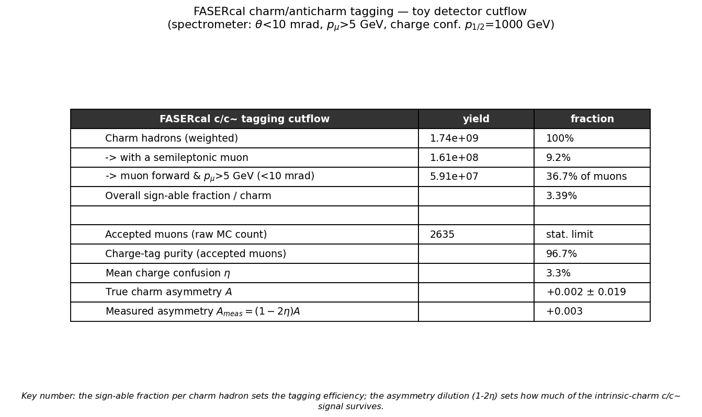
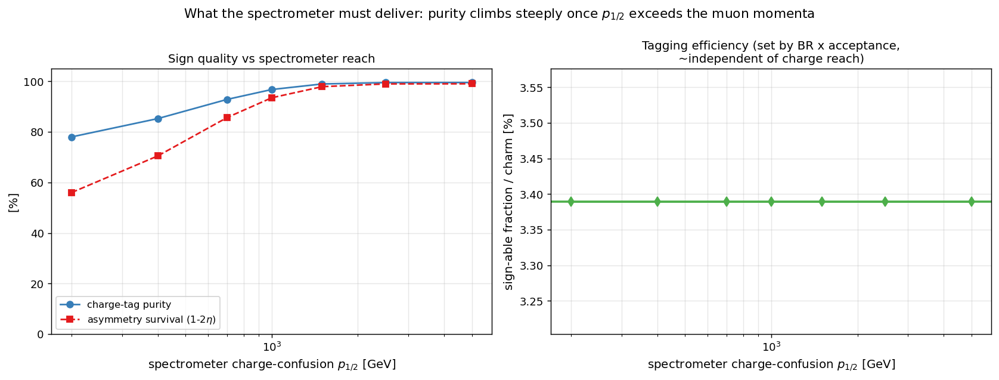

# Charm vs. anticharm identification in FASERcal — a toy MC study

**muonDIS / FASERcal · production_v1 (fitted charm) · 10 seeds × 20k × 4 samples = 800k showered events**

---

## 1. Motivation

The FASERν charm programme measures charm production in high-energy muon deep
inelastic scattering (μ DIS). In **emulsion** (FASERν, FASERν2) charm is
identified by directly imaging the **sub-mm decay kink/vertex** of the charmed
hadron. A key physics goal beyond counting charm is to separate **charm from
anticharm**, because the charm–anticharm asymmetry at large *x* is the
signature of a non-perturbative **intrinsic-charm** component of the nucleon.

**FASERcal is a fundamentally different device**: a 3D-granular plastic
scintillator calorimeter with

- **cell size ~0.5–3 cm** (vs. sub-µm emulsion resolution), and
- **no magnetic field**.

This report asks, with the real muon-DIS Pythia sample, whether and how FASERcal
can do charm/anticharm separation, and what it would need from the rest of the
Forward Physics Facility to do it.

---

## 2. The physics of the tag

Charge (c vs. c̄) is not visible in a calorimeter directly — you need a
charge-sensitive observable. The two candidates:

| handle | in emulsion (FASERν) | in FASERcal |
|--------|----------------------|-------------|
| decay **vertex/kink** | yes (sub-µm) | no — flight length ≪ cell size |
| semileptonic **decay-muon charge** | — | **the only robust handle**, but needs a B-field |

The usable observable is the muon from the **semileptonic charm decay**:

```
c  → s W⁺ , W⁺ → μ⁺ ν      (charm)      →  μ⁺  (muon PDG id −13)
c̄  → s̄ W⁻ , W⁻ → μ⁻ ν̄      (anticharm)  →  μ⁻  (muon PDG id +13)
```

so **the decay-muon charge equals the charm sign** (both +1 for c, −1 for c̄).
FASERcal sees this muon pass through minimum-ionising but **cannot measure its
charge** (no field); the sign must come from a **downstream magnetised
spectrometer** (FASER2-like). This study quantifies the whole chain:
branching → acceptance into that spectrometer → charge measurement.

---

## 3. Method

Everything reuses the muon-DIS POWHEG samples from the
[`generatoroutputanalysis`](../../generatoroutputanalysis) contamination study
(`production_v1`, fitted-charm NNPDF4.0), showered with Pythia8.

1. **`shower_charm.py`** re-showers the LHE events (`POWHEG:nFinal=2` matching)
   and, for every **weakly-decaying charm hadron** (the last charm hadron in the
   chain, after any D\*→Dπ cascade), records:
   - **sign** (+1 c / −1 c̄) from the PDG-code sign;
   - **flight length** production→decay vertex (mm);
   - the **semileptonic decay muon** attached by walking the mother chain up to
     the charm ancestor (this cleanly excludes the hard scattered muon, whose
     ancestry goes to the beam, not to a charm hadron): its **charge**, lab
     **momentum**, **polar angle**, and **pT relative to the parent D**.

   All four beam/target samples (μ±, p/n) are **tungsten-combined**
   (w_p=74/184, w_n=110/184). Ten distinct seeds are showered and concatenated —
   the 25 `pythia8_seedN` subdirectories each hold a **distinct** 20k-event
   POWHEG sample (verified by md5), so this is a genuine 10× statistics gain.

2. **`detector.py`** holds a **transparent toy** FASERcal + spectrometer
   response — *not* FASERcal specifications, deliberately simple so the result's
   dependence on them is visible:
   - **acceptance**: muon forward, within a half-cone `θ_max` (default 10 mrad),
     above `p_min` (default 5 GeV);
   - **charge confusion** η(p) rising with momentum (straighter tracks → worse
     sign), a sigmoid with half-point `p₁⁄₂` (default 1 TeV).

3. **`make_report.py`** applies the response analytically (per-muon expectation,
   no single-draw MC noise) and produces the figures below plus the PDF.

---

## 4. Results

### 4.1 The decay muon is "soft" only within the jet



The semileptonic muon carries a **median lab momentum of 11 GeV** (mean 31,
IQR 3–32, 90th pct 79, max >1 TeV). "Soft" refers to its momentum *relative to
the charm jet*, not the lab: 11 GeV implies an ionisation range of **~55 m** in
plastic scintillator (2 MeV/cm), and the 90th-percentile muon ~400 m. Since
FASERcal is only a few metres deep, **the decay muon exits MIP-like and reaches
whatever sits downstream** — which is exactly why the magnetised spectrometer,
not FASERcal, is the charge-tagging device.

### 4.2 The decay vertex is below cell size — the emulsion handle is lost



Median flight length before decay:

| hadron | cτ | median lab flight | vs. cell |
|--------|-----|-------------------|----------|
| D± | 312 µm | **6.1 mm** | ~ cell edge |
| Dₛ± | 150 µm | 3.4 mm | below |
| D⁰ | 123 µm | **2.5 mm** | below |
| Λc⁺ | 60 µm | 0.2 mm | far below |

Even boosted, charm flies a **few mm** — at or below a ~0.5–3 cm scintillator
cell. Emulsion resolves this trivially; **FASERcal essentially cannot** use the
decay vertex, confirming the semileptonic-muon route is the only viable one.

### 4.3 Tagging cutflow



| stage | fraction |
|-------|----------|
| charm hadron → semileptonic muon | **9.2 %** (matches PDG charm→μ BR — validates the chain) |
| → forward & p_μ > 5 GeV into spectrometer | ~37 % of those muons |
| **sign-able fraction per charm** | **3.4 %** |
| charge-tag purity (default 1 TeV reach) | 96.7 % (η = 3.3 %) |

The tagging efficiency is **capped by the 9 % semileptonic branching**, not by
the detector — even a perfect spectrometer cannot beat it. This sets the
statistics budget for any FASERcal c/c̄ measurement.

### 4.4 The charm asymmetry is consistent with zero at this precision

With 10× statistics (**2 635 accepted muons**):

> **A_true = (N_c − N_c̄)/(N_c + N_c̄) = +0.002 ± 0.020**  (accepted, weighted)
> A_meas = +0.003 (dilution (1−2η) negligible at these momenta)

This is the study's most important correction: an earlier single-seed run
(243 muons) showed A ≈ −0.16, which was a **pure statistical fluctuation** — it
vanishes with more events. Physically this is expected: charm production here is
dominated by **photon-gluon fusion γg→cc̄**, which produces c and c̄ in equal
numbers. Any intrinsic-charm asymmetry rides as a **small** effect on top of
this symmetric baseline.

### 4.5 What the spectrometer must deliver



Scanning the spectrometer charge-confusion reach `p₁⁄₂`: purity and asymmetry
survival `(1−2η)` stay near-perfect as long as `p₁⁄₂` exceeds the muon momenta
(tens of GeV), collapsing only when the reach drops into that range. Tagging
**efficiency** (~3.4 %/charm) is essentially independent of `p₁⁄₂` — it is set
by branching × geometric acceptance. **Conclusion: the charge measurement is the
easy part; the branching ratio is the real limiter.**

---

## 5. Bottom line

- **FASERcal alone cannot separate charm from anticharm** — no field, and the
  decay vertex is below cell size.
- The **only handle is the semileptonic-muon charge**, which requires a
  **downstream magnetised spectrometer**. At the relevant muon momenta
  (median 11 GeV) charge confusion is small, so the spectrometer is not the
  bottleneck.
- The tag reaches **only ~3 % of charm** (branching-limited), so a c/c̄
  measurement is **statistics-hungry**.
- The **truth-level c/c̄ asymmetry is ~0** in this sample (γg→cc̄ dominated);
  the intrinsic-charm signal is a small asymmetry on top and would need both the
  high statistics and the low charge-confusion this toy shows are achievable.

## 6. Caveats & next steps

- **Toy detector.** `detector.py` numbers are illustrative, not FASERcal specs.
  Fold in a realistic FASER2 acceptance + charge-confusion curve when available.
- **Statistics.** 2 635 accepted muons give σ(A) ≈ 0.02; the full 25 seeds (2M
  events) would reach ~0.013, and the real measurement needs the actual FASERν
  muon flux × exposure.
- **No reconstruction yet.** Muon momentum/angle are truth; add scintillator
  cell-level resolution and the spectrometer momentum resolution.
- **Second discriminant.** The muon **pT relative to the D direction** is
  already cached (`mu_ptrel`) and can be added as a soft-muon-in-jet handle.
- **Intrinsic charm.** Re-run on `production_pc` (perturbative charm) and compare
  the (small) large-*x* asymmetry between fitted and perturbative charm.

---

*Reproduce:* `./scripts/run_toy.sh` (shower 10 seeds + report) or
`./scripts/run_toy.sh --report-only` (rebuild from cache). Figures regenerated
with `make_report.py --png-dir docs/figures`.
